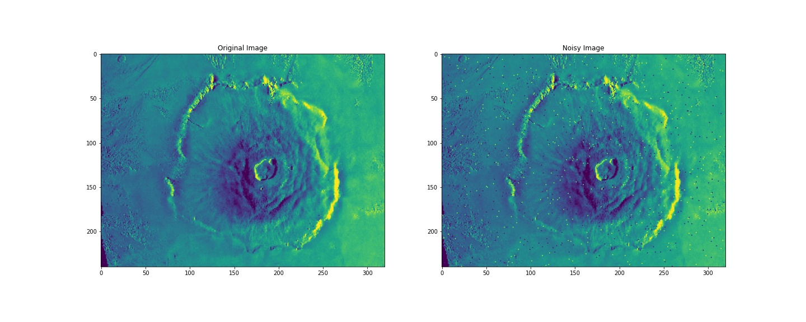
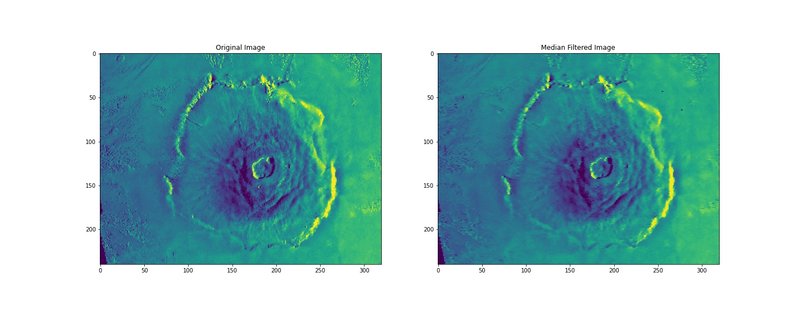
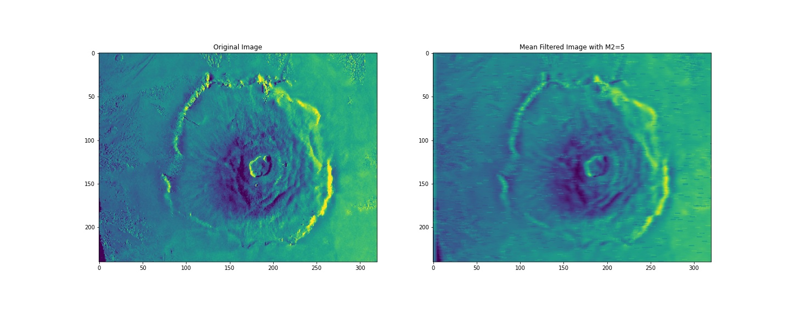
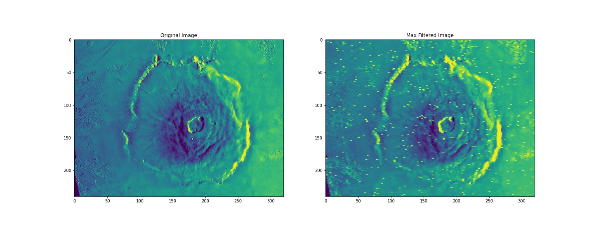

# noise-reduction
Implementing three different noise reduction filters, Median filter, Mean filter, and Max filter.

I applied three filter on the test image in `images/`.

Filtered images are in `filtered-images/` and filtered images mat files are in `/filtered-mat`.

## Requirements
- IPython
- matplotlib
- numpy
- scipy

---
---

### Noisy and Original Images
Input mat file contains original image and noisy image

---
### Median Filter

---
### Mean Filter

---
### Max Filter

